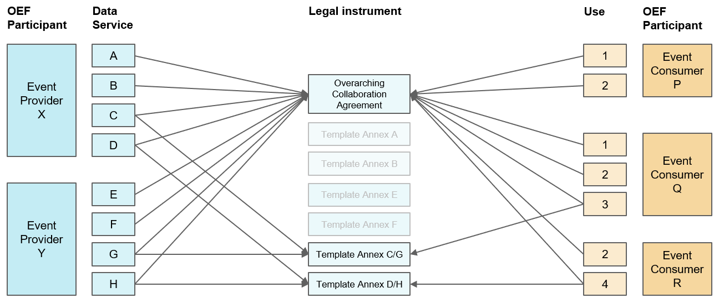

**Version: 1.0.0-alpha**

# Table of Contents

* [1 Introduction](rules-of-engagement#1-introduction)
* [2 OEF Rules of Engagement](rules-of-engagement#2-oef-rules-of-engagement)
  * [2.1 Principles](rules-of-engagement#21-principles)
  * [2.2 Default Configuration of Permissions / Entitlements](rules-of-engagement#22-default-configuration-of-permissions--entitlements)
  * [2.3 Default Governance Framework](rules-of-engagement#23-default-governance-framework)
* [3 OEF Ecosystem Governance](rules-of-engagement#3-oef-ecosystem-governance)
  * [3.1 Legal Instrumentation](rules-of-engagement#31-legal-instrumentation)
  * [3.2 Components](rules-of-engagement#32-components)
    * [3.2.1 Legal Basis](rules-of-engagement#321-legal-basis)
    * [3.2.2 Liability Framework](rules-of-engagement#322-liability-framework)
    * [3.2.3 Assurance Framework](rules-of-engagement#323-assurance-framework)
    * [3.2.4 Issue Resolution](rules-of-engagement#324-issue-resolution)
    * [3.2.5 Terms of Service](rules-of-engagement#325-terms-of-service)
    * [3.2.6 Scope of Service](rules-of-engagement#326-scope-of-service)
    * [3.2.7 Ecosystem Intent](rules-of-engagement#327-ecosystem-intent)
    * [3.2.8 Membership Administration](rules-of-engagement#328-membership-administration)
    * [3.2.9 Value Exchange Framework](rules-of-engagement#329-value-exchange-framework)
    * [3.2.10 Settlement Framework](rules-of-engagement#3210-settlement-framework)
* [Appendix](rules-of-engagement#Appendix)
  * [Bilateral Contract](rules-of-engagement#bilateral-contract)
  * [Scheme](rules-of-engagement#scheme)

# 1 Introduction

The primary objective of the Open Ecosystem Federation (OEF) is to allow separate entities to agree and execute a scalable and extensible model for collaboration through the sharing of information.

The OEF aims to deliver an open and repeatable Toolkit comprising of two parts:

* A Technical Specification (TODO: link provided soon) that is based on open standards and provides functionality to enable the _execution_ of scalable and extensible collaboration
* This **Rules of Engagement** document which is a default governance framework that facilitates the _agreement_ required for scalable, extensible and repeatable collaboration

This document both defines the OEF Rules of Engagement and sets out how OEF Participants can use the OEF Technical Specification to reference governance frameworks that go beyond the OEF Rules of Engagement. In this way, each OEF Ecosystem can combine the OEF Technical Specification with their own governance framework.

# 2 OEF Rules of Engagement

## 2.1 Principles

Both the OEF Technical Specification and OEF Rules of Engagement **must** be considered a minimum set of requirements. Entities that comply with this minimum set of requirements are referred to as OEF Participants.

Pairs and/or groups of OEF Participants **may** collaborate to share information in a given domain of interest by using the functionality defined in the OEF Technical Specification and by adhering to the OEF Rules of Engagement.

Pairs and/or groups of OEF Participants **may** also collaborate on a _mutually agreed_ basis by opting to use a governance framework that goes _beyond_ the OEF Rules of Engagement. Such pairings or groupings are referred to as OEF Ecosystems.

Any OEF Participant **may** initiate an OEF Ecosystem. Potential OEF Participants **must** be invited to join a given OEF Ecosystem and may collaborate within the ecosystem once they additionally make a decision to opt in. These commitments are recorded as Events using implementations of the OEF Technical Specification.

By definition, a given OEF Ecosystem excludes all OEF Participants which either choose not to opt in or are not invited to join. The rationale for exclusion can be opaque: they may be unable to meet the incremental requirements set out in the OEF Ecosystem's governance framework, be unaware of its existence, be unwilling to join it or are simply not invited.

Whenever OEF Participants share information, they **must** record the governance framework under which the transaction is occurring (although it is important to note that this record might not be something that is replayed with every transaction - for example, an OEF Participant may specify that it is universally acting under a given governance framework for a given period of time):
* When information is being shared under the OEF Rules of Engagement, a set of [minimum requirements](rules-of-engagement#minimum-requirements) is assumed to apply.
* When information is being shared under a governance framework that goes beyond the OEF Rules of Engagement, OEF Participants must reference artefacts which collectively comprise that OEF Ecosystem Governance.

Whenever OEF Participants form an OEF Ecosystem that references a governance framework that goes beyond the OEF Rules of Engagement, they **must** take responsibility for monitoring and enforcing compliance with that governance framework (e.g. through systems for issue identification, escalation, resolution, remediation, etc.).

It is OEF **best practice** for 'open' OEF Ecosystems (e.g. market places, extended supply chains) to make the reference to such artefacts public to all other OEF Participants.

'Open' OEF Ecosystems **must** configure such artefacts in terms of standardised models, [component parts](rules-of-engagement#32-components) and easily accessible, repeatable patterns.  These component parts must separate concerns and break granularity down to the level necessary to provision for 'policy as code'.  Simply put, everything which can be separated out and configured/considered independently **must** be separated out and defined either as data or code in an implementation of the Technical Specification.

These OEF **best practices** are designed to lower barriers to entry into a given OEF Ecosystem. However, the OEF Toolkit does not preclude or prejudice against 'closed' OEF Ecosystems (e.g. collaborations based on statutory or regulatory requirements). There is no OEF requirement to make the reference governance artefacts public to other OEF Participants beyond those already party to the OEF Ecosystem, or to use any particular form of governance.

## 2.2 Default Configuration of Permissions / Entitlements

The default configuration of the OEF Technical Specification is to permit / entitle OEF Participants to _write_ Events, but not to _read_ events. It is assumed that this default configuration complies with the vast majority of laws and regulations (i.e. everyone is entitled to write down what they think, if those thoughts remain inaccessible to everyone) and would be considered to constitute security best practice.

OEF Participants are responsible for ensuring that permissions / entitlements that extend beyond the default configuration continue to comply with all the national and international laws and regulations that are relevant to them.

In its fundamental structure, every Event includes a reference to the rights owner(s) on whose behalf the Event has been written. A rights owner is referred to as an Event Producer. In most cases, the OEF Participant will be the sole Event Producer. In others, the OEF Participant may be writing Events on behalf of another rights owner. In this situation, the OEF Participant will be playing the role of Event Provider.

When acting in the role of Event Producer, OEF Participants can _write_ their own Events, including Events that actively _grant permission_ to themselves - or any other OEF Participant - to _read_ any other Event. In the same role, OEF Participants can also _remove permission_ to read any given Event from any given OEF Participant (including themselves) at any given time. Such permissions are also referred to as entitlements.

When writing Events on behalf of other rights owners (i.e. acting as an Event Provider), OEF Participants cannot grant or remove permissions / entitlements over these Events. OEF Participants are therefore responsible for:
* identifying rights owners
* providing rights owners with a service that allows them to configure permissions / entitlements over their Events
* authenticating rights owners

The legal and regulatory context in which each OEF Participant operates will be specific to them and their domain of interest. Every OEF Participant is responsible for the configuration of permissions / entitlements that comply with their specific legal and regulatory context.

The OEF Technical Specification only provides a toolkit which enables permissions / entitlements for each individual Event to be configured in an easily _extensible_ way, and to be executed in a highly _scalable_ and _machine-readable_ environment.

## 2.3 Default Governance Framework

Whenever OEF Participants share information under the OEF Rules of Engagement, a default governance framework **must** always apply:

* The default legal basis on which OEF Participants share information is "consent" - i.e. the OEF Participant is acting _on behalf of_ the entities that act as Rights Owner(s) over the information being shared to configure permissions / entitlements according to their _active instruction_ (as recorded by a further set of Events)

* The default liability limit under which other OEF Participants access the Events being shared is zero - i.e. OEF Participants rely on the information that they access at their own risk.

* The default assurance level of the events contributed by OEF Participants is zero - i.e. the default expectation is that other OEF Participants may choose the level of trustability they read into the information exchange, and may consider the information they are consuming on a spectrum of utility.  Although the OEF Technical Specification assures the _provenance_ of Events, the OEF Rules of Engagement does not by default assure the _quality_ of the information contained in Events.

* The default legal instrument under which OEF Participants share information is the general body of national and international law and regulation that is relevant to each OEF Participant. The OEF Rules of Engagement do not assume the existence of any other construct (such as a contract, memorandum of understanding, letter of intent, etc.) between the parties that might act as a further point of reference in the eyes of the legal or regulatory authorities.

* The default enforcement mechanisms are the general enforcement mechanisms provided by national and international legal and regulatory authorities (such as the courts, ombudsman, arbitration panels, channels for complaints, etc.). The OEF Rules of Engagement does not assume the existence of any incremental and mutually agreed systems for issue identification, escalation, resolution, remediation, etc.

* The default motivation for sharing information is altruism (i.e. acting for the greater good). The OEF Rules of Engagement does not assume any requirement for reciprocal value to be exchanged in return for the act of sharing information. As a result, the default value placed on the information being shared is zero, and therefore the OEF Rules of Engagement does not assume the need for any value settlement framework (beyond that of psychic reward).

Collectively and exhaustively, these components comprise the default governance framework that constitutes the OEF Rules of Engagement. This is the default artefact that is referenced by the OEF Technical Specification.

# 3 OEF Ecosystem Governance

By design, the OEF Rules of Engagement aim to set out a minimal basis under which information is exchanged. It is therefore desirable for OEF Ecosystems to collaborate on the basis of governance frameworks that are tailored to their specific context. These frameworks are referred to as OEF Ecosystem Governance.

When information is being shared under a governance framework that goes _beyond_ the OEF Rules of Engagement, OEF Participants **must** reference legal instrumentation which collectively comprise that OEF Ecosystem Governance and establishes the legal basis under which the transaction is occurring (see [Sections 3.1](rules-of-engagement#31-legal-instrumentation) and [Section 3.2.1](rules-of-engagement#321-legal-basis) below).

The OEF Rules of Engagement enforces a default legal basis of consent, but does not seek to define the governance frameworks that are appropriate for any given OEF Ecosystem. Rather, its goal is help to associate the governance framework under which information is shared with the information itself, as a way of supporting the collaboration between the OEF Participants that comprise the OEF Ecosystem.

It is OEF best practice for OEF Ecosystems to use governance frameworks that are composed of artefacts which - over time - may become standardised points of reference within the OEF. This facilitates the _agreement_ required for scalable and extensible collaboration, making it easier for OEF Participants both to join existing OEF Ecosystems and to initiate their own.

In this section, we consider two aspects of a given governance framework: firstly, we point to the spectrum of different legal instruments that might be used to define a governance framework; secondly, we highlight some of the different dimensions of governance that may be covered by such instrumentation and which collectively compose the governance framework itself.

We recognise that neither constitutes a comprehensive or definitive set, and can only act as an initial hypothesis for the "composability" of OEF Ecosystem Governance. The intention is to test this hypothesis in a Beta phase, by using the OEF Technical Specification to reference a legally enforceable governance framework that uses a collaboration agreement based on the default setting contained in the OEF Rules of Engagement and extending across the components set out below.

## 3.1 Legal Instrumentation

There are a number of legal bases on which governance frameworks can be constructed. Taking the EU's General Data Protection Regulation (GDPR) as an example, there are six lawful bases for processing personal data: consent, contract, legal obligation, vital interests, public task and legitimate interests.

It is expected that the majority of OEF Ecosystems that rely on a legal basis that goes beyond the default of consent set out in the OEF Rules of Engagement will do so under contract. The precise nature of the contract used to articulate a given OEF Ecosystem Governance model may vary. For example, it is easy to identify at least three such variants:

* [Bilateral contract](rules-of-engagement#bilateral-contract)
* Multilateral [collaboration agreement](rules-of-engagement#collaboration-agreement)
* Bilateral contracts with a legal entity tasked with operating a [scheme](rules-of-engagement#scheme)

Given the expected use of a contract in the form of a collaboration agreement to suppport the Beta phase, we use this section to focus on this particular variant of legal instrumentation. The [Appendix](rules-of-engagement#appendix) elaborates further on contracts organised bilaterally or as a scheme.

A collaboration agreement is a contract that covers multiple data services and uses, using template annexes to reflect any incremental dimension of governance that is specific to a particular data service and/or use.

The collaboration agreement governs the information exchange between _several_ OEF Participants acting as Event Providers and _several_ OEF Participants acting as Event Consumers, all of whom choose to submit to the terms which it contains.

A collaboration agreement therefore provides a common artefact which can be referenced by all the OEF Participants - in other words, unlike a master service agreement, it is a multilateral agreement. The collaboration agreement may include the constitution of administrative roles and mechanisms to support the evolution of the agreement itself over time ([see Section 3.2.7](rules-of-engagement#327-membership-administration)).

**_Figure 1: Collaboration Agreement_**

_[Source: Pinsent Masons]_

As the name suggests, collaboration agreements are likely to be best suited to ecosystems where the participants are actively looking to collaborate with one another to streamline the mechanisms through which agreement can be reached to share information.

It is OEF best practice to reference an open and standard artefact as the legal basis for collaboration. For example:
* Where an OEF Participant is making information available to all other OEF Participants (e.g. as 'open data'), they may reference the terms of an open and standard licence.
* Where OEF Participants share information multilaterally, they may invite others to participate under the terms of an open and standard collaboration agreement.

It is still possible for Event Providers to compete to provide data services to Event Consumers under the terms of a collaboration agreement. However, they have agreed to do so under a common governance framework.  

## 3.2 Components

This section elaborates a non-exhaustive list of the different dimensions that OEF Ecosystems might use to compose the governance framework under which they have mutually agreed to collaborate. These dimensions might be captured in a form of legal instrumentation (such as the examples in the section above), which in turn can then be referenced as the basis for information sharing via implementations of the OEF Technical Specification.

### 3.2.1 Legal Basis

OEF Ecosystems **may** share information on a legal basis that is different from the legal basis of "consent" that is the default under the OEF Rules of Engagement.

Taking the EU's General Data Protection Regulation (GDPR) as an example, there are six lawful bases for processing personal data: consent, contract, legal obligation, vital interests, public task and legitimate interests.  

When personal data is involved, the GDPR imposes a high duty of care upon data controllers in selecting their data processing service providers. This duty of care may be reflected in specific clauses within the legal instrumentation used to set out OEF Ecosystem Governance.

### 3.2.2 Liability Framework

OEF Ecosystems **may** choose to accept a level of liability linked to the quality of the information being shared that is greater than the level of zero that is the default under the OEF Rules of Engagement.

OEF Ecosystem Governance that includes a liability framework (linked to data quality standards and assurance levels) gives those OEF Participants a basis for recourse if they rely on the information being shared.

### 3.2.3 Assurance Framework

OEF Ecosystems **may** choose to specify a level of assurance over the quality of information on specific events that is greater than the level of zero that is the default under the OEF Rules of Engagement.

The OEF Technical Specification enforces a level of assurance as to the _lineage_ or _provenance_ of information. However, it does not impose or generate any level of assurance about the _quality_ of the information being shared - it may range from well formed but nonsensical to highly refined insight.  Assurance framework specifics will depend on the context of the types of information exchange present in an ecosystem and the domains and subdomains over which the participants are intersecting.

### 3.2.4 Issue Resolution

Issue resolution mechanisms are closely linked to liability and assurance frameworks. These **may** involve mutually agreed procedures to identify, remediate and resolve issues, as well as sanctions for ecosystem members that fail to observe them (e.g. expulsion from the ecosystem).

### 3.2.5 Terms of Service

OEF Participants **may** use an implementation of the OEF technical specification to reference terms of service that cannot (yet) be expressed within the ontology. These might include service levels, feedback loops, revocation rights, etc.

For example, OEF Ecosystems **may** choose to specify a service model that is designed to encourage members to behave as good ecosystem "citizens" and to minimise the need for escalation of issues by alerting Event Providers to issues with their data service on the basis that the Event Provider will use the feedback to address the issues - and improve data services - in a timely manner.

### 3.2.6 Scope of Service

The default scope of service within the OEF Technical Specification is the provision of access to write information in the form of Events. The OEF Technical Specification defines the service via its core administration responsibilities and ontology.

OEF Participants **may** expand the administrative responsibilities and ontology to express key features of this service (such as time-to-live, access expiry, etc.) and to express an expansion of the scope of service (such as mirroring, notifications, etc.).

### 3.2.7 Ecosystem Intent

OEF Participants **may** use an implementation of the OEF Technical Specification to reference a mechanism that defines the intent of a given OEF Ecosystem, beyond the immediate transaction involved in sharing information.

For example, intent may be used to capture what is expected of the members of the OEF Ecosystem, what good reciprocation looks like, how common interests are protected, etc.

### 3.2.8 Membership Administration

An OEF Ecosystem **may** use an implementation of the OEF Technical Specification to reference artefacts used to administer its membership. Such artefacts might include (but are not limited to):  

* The _people_ or _entities_ responsible for administration. For example, an OEF Ecosystem operating under a collaboration agreement may appoint a 'Steward' to be responsible for maintaining the agreement and administering the process of members signing up to it
* The _policies_ used to determine membership. For example, an OEF Ecosystem comprises of members of a given club: to become a member of the club, parties must be recommended by at least one other member.
* The _mechanisms_ or _tools_ used to assign or revoke the attributes or characteristics required to participate in an OEF Ecosystem. For example, the process for administering membership is handled using Github and Github accounts.  

### 3.2.9 Value Exchange Framework

The default motivation for sharing information is altruism. The default value placed on the information being shared is therefore zero.

OEF Participants **may** use an implementation of the OEF technical specification to reference a value on the information being shared that is greater than the default value of zero that is the basis for the OEF Rules of Engagement.

Access to the information within that OEF Ecosystem will then be contingent on settlement to that value. OEF best practice is to reference open and standard values (such as currency-based prices) to minimise barriers to entry.

### 3.2.10 Settlement Framework

The default reward for those sharing information or expertise within OEF ecosystems is "psychic reward" therefore unless configured otherwise via a Collaboration Agreement there is no value settlement framework in place.

OEF Participants **may** use an implementation of the OEF technical specification to reference a value settlement framework that is different to the default settlement framework that is the basis for the OEF Rules of Engagement.

OEF best practice is to reference open and standard settlement frameworks (such as currency-based payment schemes) to minimise barriers to entry.

# Appendix

## Bilateral Contract

The second example of legal instrumentation is that of a bilateral contract between an OEF Participant acting in the role of Event Provider and another OEF Participant acting in the role of Event Consumer. The contract specifies the terms under which the Event Provider makes a given data service available to the Event Consumer for a given purpose or use.

The OEF Participants use their respective implementations of the OEF Technical Specification to reference the relevant contract as the primary artefact which describes the governance framework under which the information (in the form of Events) is being shared, as illustrated in Figure 1.

**_Figure 2: Bilateral Contracts between Event Providers and Event Consumers_**

_[Source: Pinsent Masons]_

Contractual arrangements like this may be best suited to competitive ecosystems (e.g. markets) where different Event Providers compete to offer a range of data services. In such an environment, there may be competitive advantage in using a single contract that covers multiple data services and uses (e.g. a master service agreement).

## Scheme

The third example of legal instrumentation is that of a scheme. Each OEF Participant that opts to join an OEF Ecosystem governed by a scheme signs a bilateral contract with the legal entity that is tasked with operating that scheme.

Schemes are often used to mutualise the costs and risks inherent in sharing information. The existence of the legal entity dedicated to operating the scheme provides a vehicle for shared operations (such as dispute resolution and scheme administration) and shared risk management (such as access to balance sheet strength).

**_Figure 3: Scheme_**

_[Source: Pinsent Masons]_

Schemes provide the governance framework for many ecosystems already operating today, and the key properties of a scheme are desirable in many contexts. However, schemes can also have properties that make them undesirable in other contexts:

* Schemes can result in high barriers to entry into the ecosystem, leading to anti-competitive behaviour
* Schemes are usually very specialised in terms of the data services and uses in scope
* Schemes risk becoming 'gold-plated' and/or 'outdated' as the legal entity that operates is required to play an intermediary role but is constrained in its ability to innovate the way it executes that role

Although schemes provide an entirely valid governance framework for any OEF Ecosystem, schemes that hold these properties work _against_ the primary objectives of the OEF (i.e. to agree and execute a _scalable_ and _extensible_ model for collaboration through the sharing of information).
